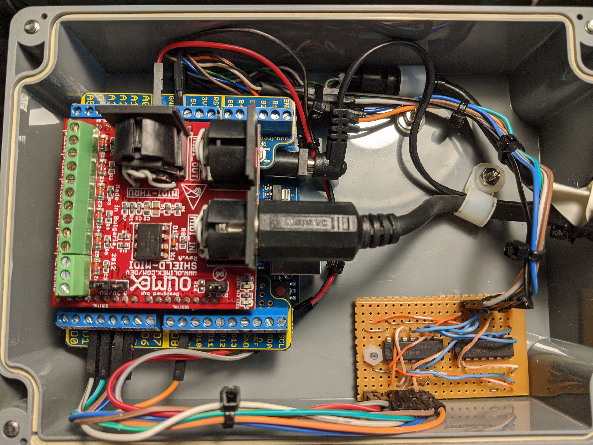

# midi2c64joy

C64 MIDI to joystick adapter

This driver maps MIDI messages to C64 (or Atari 2600 compatible) joystick movements,
using 4066 analog switches.  This allows, for example automation of C64 based VJ
applications like Vicficken from Ableton.
